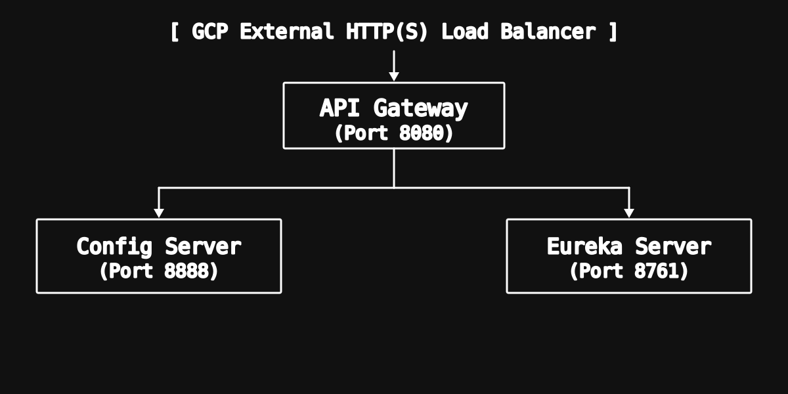

# Microservice Platform - Cloud Infrastructure Super Repository

This repository is the centralized parent repository, or super-repo, for the foundational backend platform components of the enterprise cloud architecture. It uses Git submodules to manage the core Spring Cloud infrastructure services that support distributed microservice coordination, centralized configuration, request routing, and edge load balancing.

## Project Information

| Field | Details |
| :--- | :--- |
| Student Name | Nethmi Nanayakkara |
| Student ID | 241722047 |
| GCP Project ID | `nethmi-project` |
| Module | ITS 2130 - Enterprise Cloud Architecture |
| Repository Type | Backend Platform Super-Repository (Polyrepo Pattern) |

## Architectural Overview



The platform is organized so that external traffic enters through the load balancer, reaches the API Gateway, and then relies on the Config Server and Eureka Server for runtime configuration and service discovery.

## Submodule Components

| Submodule Name | Role | Technology Stack | Port | Repository Link |
| :--- | :--- | :--- | :--- | :--- |
| Eureka Server | Dynamic Service Registry and Discovery | Spring Cloud Netflix Eureka | `8761` | [Eureka_Server](https://github.com/NethmiDN/Eureka_Server) |
| Config Server | Centralized Runtime Configuration | Spring Cloud Config | `8888` | [Config_Server](https://github.com/NethmiDN/Config_Server) |
| API Gateway | Reverse Proxy, Dynamic Routing, CORS | Spring Cloud Gateway | `8080` | [API_Gateway](https://github.com/NethmiDN/API_Gateway) |

## Technology Stack

- Java 21
- Spring Boot 3.4.x
- Spring Cloud for Eureka, Config, and Gateway
- Google Compute Engine for deployment
- Git submodules for repository composition

## Cloning and Local Setup

Because this super-repository contains Git submodules, clone it with the `--recurse-submodules` flag:

```bash
git clone --recurse-submodules https://github.com/NethmiDN/Microservice_Platform.git
cd Microservice_Platform
```

If the repository is already cloned, initialize the submodules with:

```bash
git submodule update --init --recursive
```

## Deployment Topology

- GCP External HTTP(S) Load Balancer receives inbound traffic.
- API Gateway runs on port `8080` and acts as the primary routing and CORS boundary.
- Config Server runs on port `8888` and provides centralized runtime configuration.
- Eureka Server runs on port `8761` and provides service registration and discovery.

## Notes

- This repository is the parent container for the platform services rather than a standalone application module.
- Each submodule is maintained in its own repository.
- The architecture is designed to support a Spring Cloud based microservice ecosystem.
